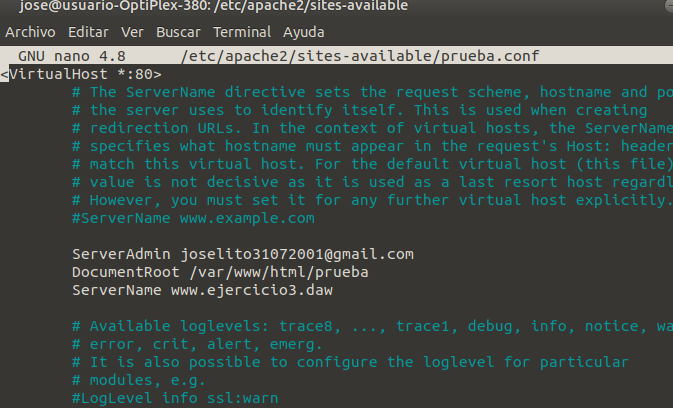
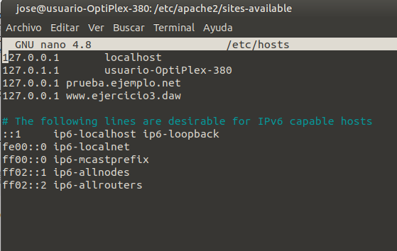

# EXAMEN DAW

## Copia del archivo /etc/hosts

En este Markdown explicaremos el procedimiento de el ejercicio 2 del examen de `Despliegue de aplicaciones Web`.

Antes de empezar el ejercicio haremos una copia del archivo que vamos a modificar por si acaso.

Para crear una copia podemos hacerlo manualmente o con el siguiente comando:

    $ cp /etc/hosts ~/Escritorio

## Crear el script

Para trabajar más agusto creamos una carpeta para trabajar dentro de ella.

```
    $ mkdir ejercicioExamen
    $ cd ejercicioExamen
```

Dentro ya de la carpeta creamos el script, en mi caso lo voy a crear usando el comando nano y lo voy a llamar `script1`:

    $ nano script1.sh

Acto seguido damos los permisos necesarios para poder ejecutarlo.

    $ chmod +x script1.sh

En el primer apartado del ejercicio nos pide que comprobemos los parametros pasados al eejcutar el archivo.

Como primer parámetro se le podrán pasar dos : `enable` y `disable`.

En caso de que sea enable recogerá el segundo parámetro que le pasemos y lo guardará en el archivo `/etc/hosts`.

Para comprobar que se le pasen los parametros correctamente empezamos con dos condicionales sencillos con doble condicion:

```
#!/bin/bash

if [[ ($1 == "enable") || ($1 == "disable") ]];
then
        if  [[ ($1 == "enable") && ( $# -eq 2) ]];
        then
                echo "enable y direccion"
        else
                echo "enable y nada"
        fi 
else
        echo "no"
fi

```

De esta forma se comprueba que el primer parámetro sea `enable` o `disable` y que distinga entre los dos.

Dependiendo del parámetro que se le pase el script nos hará una acción o otra.

Cuando le pasamos `enable` recogerá el segundo parámetro (la dirección). Si se encuantra le dirección modificara la su IP a la siguiente: `127.0.0.1` y si la dirección no existe insertará la dirección con la IP: `127.0.0.1`.

El script quedará tal que así:

```
#!/bin/bash

if [[ ($1 == "enable") || ($1 == "disable") ]];
then
        if  [[ ($1 == "enable") && ( $# -eq 2) ]];
        then
                if  grep $2 ~/etc/hosts;
                then
                        sed -i "/$2/d" ~/etc/hosts
                        echo "127.0.0.1 $2" >> ~/Escritorio/prueba.txt
                else
                        echo "127.0.0.1 $2" >> ~/etc/hosts
                fi
        else if [[ ($1 == "disable") && ($# -eq 2) ]];
        then
                sed -i "/$2/d" ~/etc/hosts
        else
                echo "Tiene que pasar un segundo parametro."
        fi 
        fi
else
        echo "No esta usando el script correctamente"
fi

```

Para la segunda parte del ejercicio nos pide que cuando pasemos tres parámetros al script nos haga una accion o otra dependiendo del primer parametro (enable/disable).

Esta vez, con otros condicionales simples, comprobaremos que se le pasen 3 parámteros correctamente. Dentro del condicional donde comprobamos si el primer parámetro es enable o disable creamos los otros dos condicionales de la siguiente forma:

```
#!/bin/bash

if [[ ($1 == "enable") || ($1 == "disable") ]];
then
        if  [[ ($1 == "enable") && ( $# -eq 2) ]];
        then
                if  grep $2 ~/etc/hosts
                then
                        sed -i "/$2/d" ~/etc/hosts
                        echo "127.0.0.1 $2" >> ~/etc/hosts
                else
                        echo "127.0.0.1 $2" >> ~/etc/hosts
                fi
        else if [[ ($1 == "disable") && ($# -eq 2) ]];
        then
                sed -i "/$2/d" ~/etc/hosts

        else if [[ ($1 == "enable") &&  ($# -eq 3) ]];
        then
                sed -i "/localhost/d" ~/etc/hosts
                echo "$3 localhost" >> ~/etc/hosts

        else if [[ ($1 == "disable") && ($# -eq 3 ) ]];
        then
                echo "no se hacer esta parte"

        else
                echo "Tiene que pasar un segundo parametro."    
        fi
        fi
        fi
        fi
fi

```

Finalmente, el ejercicio nos pide la ocpión de proporcionar la información del archivo que estamos modificando y información sobre como usar el script.

Con otro condicional diferente al de los anteriores apartados comprobamos si solo se le esta pasando un parámetro y dependiendo cual se le pase hacemos una acción o otra(--help o --cat):

```
#!/bin/bash

if [[ ($1 == "enable") || ($1 == "disable") ]];
then
        if  [[ ($1 == "enable") && ( $# -eq 2) ]];
        then
                if  grep $2 ~/etc/hosts
                then
                        sed -i "/$2/d" ~/etc/hosts
                        echo "127.0.0.1 $2" >> ~/etc/hosts
                else
                        echo "127.0.0.1 $2" >> ~/etc/hosts
                fi
        else if [[ ($1 == "disable") && ($# -eq 2) ]];
        then
                sed -i "/$2/d" ~/etc/hosts

        else if [[ ($1 == "enable") &&  ($# -eq 3) ]];
        then
                sed -i "/localhost/d" ~/etc/hosts
                echo "$3 localhost" >> ~/etc/hosts

        else if [[ ($1 == "disable") && ($# -eq 3 ) ]];
        then
                echo "no se hacer esta parte"

        else
                echo "Tiene que pasar un segundo parametro."    
        fi
        fi
        fi
        fi
else if [[ ($# -eq 1) && ($1 == "--help") ]];
then
        echo "Para usar el script es necesario introducir lo siguiente:"
        echo "./script.sh <enable/disable> <dirección_web>"
        echo "O bien de la siguiente manera:"
        echo "./script.sh <enable/disable> <dirección_web> <ip>"
else if [[ ($# -eq 1) && ($1 == "--cat") ]];
then
        cat ~/etc/hosts
else
        echo "No se esta usando correctamente el script"

fi
fi
fi
```

## CREACION DE VIRTUALHOST

Comprobamos si tenemos instalado `Apache` Correctamente para que no tengamos ningun tipo de problema al crear nuestro VirtualHost.

Creamo la página que vamos a mostrar en la dirección : "www.ejercicio3.daw", podemos crear manuelmente un html sencillo con nuestro nombre o de la siguiente manera:

    nano index.html

Si entramos desde nuestra IP veremos la página por defecto de Apache.

Para mover nuestra página al directorio raiz y que nos salga como predeterminada creamos una carpeta dentro de : /var/www/html/prueba

Procederemos a mover la página que hemos creado a la dirección de antes:

```
sudo mkdir /var/www/html/prueba2
sudo mv index.html /var/www/html/prueba

```

Ahora que tenemos bien situada nuestra página procederemos a configurarla en la dirección : "www.ejercicio3.daw".

Nos situamos en la carpeta de configuración de Apache:

    cd /etc/apache2/sites-available/

Dentro de esta carpeta copiaremos el archivo predeterminado de configuración para nustra carpeta creada anteriormente:

    sudo cp 000-default.conf prueba.conf

Modificaremos el archivo de la siguiente forma:

    sudo nano prueba.conf

Dentro cambiaremos y pondremos el nombre de nuestro dominio en este caso "prueba.ejemplo.net" a la derecha de VirtualHost y seguidamente escribiremos lo siguiente:

    Para definir el correo electronico de ayuda:

    "ServerAdmin [nuestro email]"

    Para definir el directorio donde se encuntran nuestros archivos:

    "DocumentRoot /var/www/html/prueba"

    El nombre de nuestro servidor:

    "ServerName www.ejercicio3.daw"

El archivo quedaría de la siguiente forma:



Dentro del archivo hosts procederemos a añadir nuestra nueva dirección, podemos hacerlo manualmente abriendo el archivo de la siguiente forma:

    sudo nano /etc/hosts

Una vez dentro añadimos nuestra IP junto a la dirección de la siguiente forma:



Una vez configurado nuestro servidor activaremos los virtual hoost de la siguiente forma:

    sudo a2ensite prueba.conf

Configurando mi página de prueba me ha pedido que ejecute el siguiente comando:

    sudo systemctl reload apache2

## CONCLUSION

En este examen hemos creado un script para poder modificar el archivo /etc/host de forma que podamos cambiar la s diferentes IP y direcciones dependiendo de cuales queramos msotrar.

Este script toma los parametros dados y dependiendo de cuales sean modifica el archivo dicho. Además puede proporcionar cierta información para el mismo uso del script.

En el siguiente apartado hemos probado a crear nuestro porpio VirtualHost en la dirección "www.ejercicio3.daw" desde dentro de la carpeta raiz de nuestro ordenador hemos creado y modificado los archivos para que al escribir esta dirección nos muestre la página que deseamos.

Finalmente he subido este archivo markdown junto al script al repositorios público de GitHub.


